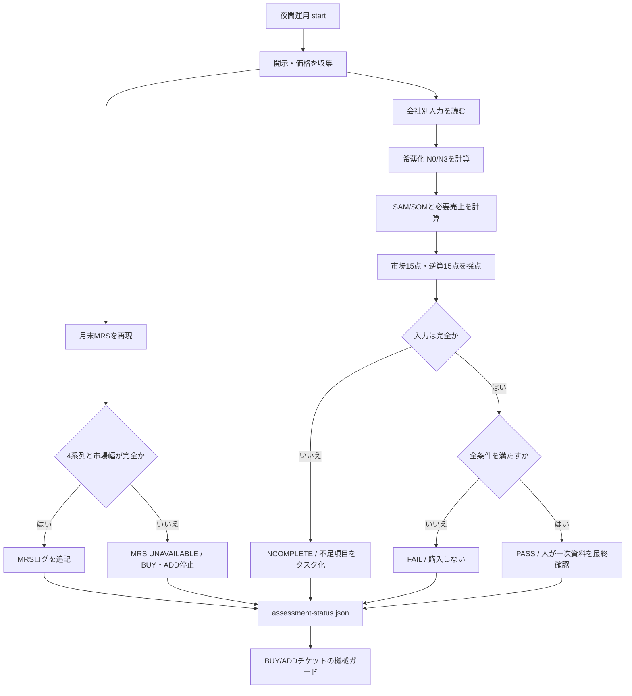

# 判断計算の自動化 v0.1

## 目的

夜間運用は、正式`MRS-v0.1`、完全希薄化後株式数、`SAM-3Y` / `SOM-3Y`、3年後の10倍経路を毎回再計算する。未知の値を推測で埋めず、`PASS`、`FAIL`、`INCOMPLETE`のいずれかを証跡にする。

計算コードと空の入力テンプレートはpublic repoに置く。会社別の未公開メモ、仮定、一次資料の参照ID、計算結果はprivate repoの`operations/private/`にだけ置く。

## 夜間フロー



`PASS`でも自動発注しない。夜間処理は最大でも`WATCH`を作り、注文候補への変更、証券会社への入力、発注は人が行う。`SELL`と`REDUCE`は、MRSや入口評価の欠損で妨げない。

## 人が入力するもの

`operations/templates/investment-case-input-template.json`をprivate repoの`operations/private/research-inputs/investment-cases/<code>.json`へコピーし、次を一次資料から記録する。

| トリガー | 人が行うこと | 夜間処理が行うこと |
|---|---|---|
| 初回候補化 | 発行済・自己・潜在株式、現預金、負債を入力 | `N0`、基本・悪化`N3`、時価総額、EVを計算 |
| 初回候補化 / 本決算 | 3〜5社の直接競合、出口PER、純利益率を固定 | 競合中央値・75%点、必要利益・売上・3年CAGRを計算 |
| 市場資料の確認 | `SAM-3Y`、到達可能シェア、能力上限と証拠区分を入力 | 必要シェア、需要上限、`SOM-3Y`、市場15点を計算 |
| KPI資料の確認 | 最大3ドライバーの現在値と3年値を入力 | 必要売上との接続、逆算15点を計算 |
| 100点採点 | 市場15点・逆算15点以外の6区分を採点し、合計を`other_score`（0〜70）へ入力 | 市場点・逆算点と合算し、70点条件を判定 |
| 決算・資本政策の開示 | 同じファイルを更新し`as_of_jst`を進める | 新しい開示を検出すると旧評価を`STALE`にする |
| 毎月のJPX統計公表 | 原則作業なし。取得障害時だけURLを確認 | TOPIX、Growth 250、市場幅、日経VI、先行CIからMRSを追記 |

会社が開示していないKPIは「後日の実行で自然に埋まる値」ではない。ルールが未開示を0点と定める項目は0点の証拠区分を入力し、数値そのものが必要なハードゲートは`INCOMPLETE`のまま購入しない。

## 計算と安全条件

- `N0 = 発行済 - 自己株式 + 株価10倍時に行使可能な全潜在株式`
- `N3 = N0 + 3年内に必要な追加調達株式`
- 潜在株式の行使代金はEVで別計上し、株式数と相殺しない。
- `M10 = 10 × 評価価格 × N3`
- `必要純利益 = M10 ÷ 出口PER`
- `必要売上 = 必要純利益 ÷ 想定純利益率`
- `SOM-3Y = min(SAM-3Y × 到達可能シェア, 販売・生産能力上限)`
- 必要売上が`SOM-3Y`を超える、KPI経路が必要売上に届かない、変動行使価額で株式数を固定できない、重大リスクが未解決、のいずれかは`FAIL`になる。
- BUY/ADDには会社評価`PASS`、正式MRSの`NORMAL`または`CAUTION`、既存の全ハードゲート・70点・流動性条件が必要。
- `other_score`は売上・粗利益20点、成長加速10点、営業レバレッジ15点、継続性10点、財務・資本配分10点、経営・開示5点の合計である。市場15点と逆算15点は重複入力せず、この処理が算出する。

## 出力

- `operations/private/market-regime-log.csv`: 後から上書きしない月末MRS
- `operations/private/runs/<date>/assessment-status.json`: 当夜の全体状態
- `operations/private/runs/<date>/investment-cases/<code>.json`: 会社別の全計算過程
- `operations/private/runs/<date>/work-plan.json`: 入力不足または再評価が必要な人のタスク

単体で確認する場合は次を使う。

```bash
.venv/bin/python scripts/investment_case.py \
  operations/private/research-inputs/investment-cases/4052.json
```
